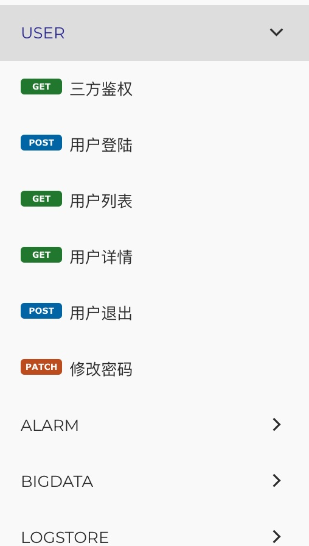

<p align="center">
  
</p>

<h1 align="center">eAPI</h1>
<p align="center">一个通过分析代码生成 OpenAPI 文档的工具</p>
<p align="center"><b>还不用写注解</b></p>

## 介绍

eAPI 通过分析 AST 生成 **接口文档** 及 **前端代码**。与 swaggo/swag 等工具不同之处在于，eAPI 无需编写注解即可使用。另外，eAPI 还支持生成 Typescript 类型代码 和 前端接口请求代码。

eAPI 首先解析出代码中的路由（方法/路径）声明，得到接口的 Path、Method 及对应的 Handler 函数。然后再对 Handler 函数进行解析，得到 请求参数（Query/FormData/JSON-Payload等）、响应数据等信息。最终生成一份符合 OpenAPI 3 标准的 JSON 文档。

eAPI 目前支持了 gin, echo 框架的文档生成，其他主流框架在计划中。如果你需要将 eAPI 应用在其他未被支持的框架，可以通过编写自定义插件的方式进行实现，或者给我们提交 PR。

## 安装

```shell
go install github.com/gotomicro/eapi/cmd/eapi@latest
```

## 如何使用
1. 创建配置文件

在代码根目录创建配置文件 `eapi.yaml`: 
```yaml
plugin: gin # 目前支持 gin 和 echo
output: docs
dir: .
```

2. 生成文档

在代码根目录执行命令: 
```shell
$ eapi
```

执行完成后会在 `docs` 目录下生成 `openapi.json` 文件。

[完整的配置说明](#配置)

## 配置

如下是完整的配置文件示例:

```yaml
output: docs # 输出文档的目录
plugin: gin # gin | echo . 取决于你使用的框架，目前支持了 gin 和 echo
dir: '.' # 需要解析的代码目录

# 可选. 请求/响应数据中依赖的类型对应的包
depends:
 - github.com/gotomicro/gotoant
 - gorm.io/datatypes

# 可选. 插件配置. 用于自定义请求响应的函数调用
properties:
  # 自定义请求参数绑定
  request:
    - type: '*server/pkg/handler.CustomContext'
      method: 'Bind'
      return:
        data:
          type: 'args[0]' # 指定第一个函数参数为请求参数
  # 自定义响应函数
  response:
    - type: '*server/pkg/handler.CustomContext'
      method: 'JSONOK'
      return:
        contentType: 'application/json'  # 指定响应的 content-type
        data: # 这是一个嵌套的数据格式示例 '{"code":0,"msg":"hello",data:{...}}'
          type: 'object'
          properties:
            code:
              type: 'number'
            msg:
              type: 'string'
            data:
              optional: true # 是否可选. 默认 false
              type: 'args[0]' # 指定为第一个函数参数
        status: 200 # 指定为 200 状态码

# 可选. 配置代码生成器
generators:
  - name: ts # 生成器名称. 暂时只支持 "ts" (用于生成 typescript 类型)
    output: ./src/types # 输出文件的目录. 执行完成之后会在该目录下生成TS类型文件
```

### Properties
`properties` 用于配置自定义请求参数绑定函数和响应输出函数。

#### 自定义请求参数绑定函数

配置示例：
```yaml
properties:
  # 自定义请求参数绑定
  request:
    - type: '*server/pkg/handler.CustomContext'
      method: 'Bind'
      return:
        data:
          type: 'args[0]' # 指定第一个函数参数为请求参数
```

#### 自定义响应输出函数

配置示例：
```yaml
response:
    - type: '*server/pkg/handler.CustomContext' # 方法所在的 package/receiver
      method: 'JSONOK'
      return:
        contentType: 'application/json'  # 指定响应的 content-type
        data: # 这是一个嵌套的数据格式示例 '{"code":0,"msg":"hello",data:{...}}'
          type: 'object'
          properties:
            code:
              type: 'number'
            msg:
              type: 'string'
            data:
              optional: true # 是否可选. 默认 false
              type: 'args[0]' # 指定为第一个函数参数
        status: 200 # 指定为 200 状态码
```

其中，data type 可选值为：
- string
- number
- integer
- boolean
- array
- file
- object

此外，还可以将函数入参作为参数类型，eAPI 会自动解析对应的参数类型。比如 `args[0]` 代表函数第一个参数。

完整的配置参考 https://github.com/link-duan/eapi/blob/main/plugins/common/config.go 下面的 `DataSchema` 类型声明。

### 代码生成器配置

如果需要使用代码生成功能，需要在配置文件内添加如下配置:
```yaml
# 可选
generators:
  - name: ts # 生成器名称. 暂时支持 "ts" | "umi" 
    output: ./src/types # 输出文件的目录. 执行完成之后会在该目录下生成TS类型文件
```

#### umi-request 请求代码生成
   
   umi 代码生成器用于生成适用于使用 `umi.js` 框架的前端接口请求代码及 TypeScript 类型。
   示例配置：
   ```yaml
   generators:
     - name: umi
       output: ./src/requests # 输出文件的目录
   ```
  
#### Typescript 类型生成

   ts 代码生成器用于生成 TypeScript 类型代码。
   示例配置：
   ```yaml
   generators:
     - name: ts
       output: ./src/types # 输出文件的目录
   ```

## 注解

如果你需要对文档的内容进行更精细化的调整（比如接口标题、字段是否必选等），那么你需要使用到注解。

### 默认情况

如果没有写注解，eAPI 也会帮你生成关于接口的必要信息。对应关系如下：

| 接口信息   | 默认值  |
|  :-   |   :-   |
| 接口的 summary (标题)  |  `pkg.HandlerName` handler 函数所在的包名和函数名共同组成接口标题。如果有注释，会默认使用注释作为标题 |
| 接口描述 | handler 函数的注释（非注解部分） |
| Path/Query/Form参数 | 根据代码生成。比如 gin 里面的 `ctx.Query("q")` 会被解析为 query 参数 q 。如果在这行代码上面加上注释，则会被作为这个参数的描述 |
| 请求 Body | 根据代码生成。比如 gin 里面的 `ctx.Bind(&request)` 参数绑定 |
| Model 字段描述 | 字段注释 |
| 接口地址 | 根据代码里面的路由声明自动解析 |

### `@summary`

允许写在 handler 函数的上方。用于设置接口的 `summary`（或者叫标题）。

示例
```go
// @summary 创建 XXX 资源
func Create(c *gin.Context) {
  // your code
}
```

### `@required`

用于设置字段是否必填。允许写在 struct 字段注释里 或者 获取请求参数注释里。

> 注意：最新的 OpenAPI 标准中，没有对 **可选字段** 提供支持，只能设置必选字段。

#### 示例1

struct字段注释
```go
type XxRequest struct {
  // 我是字段描述
  // @required
  Title string `json:"title"`
}
```

在这个示例里面，"我是字段描述” 会被显示为文档中的字段描述，并且会被显示为必填字段。

#### 示例2

请求参数获取
```go
// Create 创建 XXX 资源接口
func Create(c *gin.Context) {
  // 分类 ID
  // @required
  categoryId := c.Param("categoryId")
  // @required
  arg0 := c.Query("arg0")
  arg1 := c.Query("arg1")
}
```

在这个示例里面有三个参数：
- categoryId Path参数 字段描述:"分类 ID" 字段必选
- arg0 Query参数 无字段描述 必选
- arg0 Query参数 无字段描述 非必选

### `@consume`

用于设置接口请求 body 的 content-type 。默认为 `application/json`。允许写在 handler 函数注释里面。

示例
```go
// @consume application/xml
func Create(c *gin.Context) {
  var request view.CreateXxRequest
  err = c.Bind(&request)
  // ...
}
```

在上面这个示例里面，请求参数 request 会被认为是 XML 格式。

### `@produce`

用于设置接口响应 body 的 content-type 。默认为 `application/json`。允许写在 handler 函数注释里面。

示例
```go
// @produce application/xml
func Create(c *gin.Context) {
  var res view.CreateXxResponse
  // ...
  c.JSON(http.StatusOK, res)
}
```

在上面这个示例里面，响应 Body 数据 res 会被认为是 XML 格式。

### `@ignore`

用于忽略不需要展示在文档中的接口。允许写在以下位置：

1. 代码文件头部：会忽略整个文件的接口
2. 代码块上方：忽略代码块内的接口

```go
func registerRoutes(g *gin.RouteGroup) {
  // @ignore
  {
    // 代码块内的路由都会被忽略
    g.GET("/v1/resources", handler.ResourceList)
    g.POST("/v1/resources", handler.ResourceCreate)
  }

  // 代码块外面的不会被忽略
  g.GET("/v1/pods", handler.PodList)
}
```

上面这个示例中，代码块内的两个接口都会被忽略，不会展示在文档中。而代码块外面的 `GET /api/pods` 接口则不会被忽略。

3. 函数注释：忽略函数内的接口

```go
// @ignore
func registerRoutes() {
  g.GET("/v1/resources", handler.ResourceList)
  g.POST("/v1/resources", handler.ResourceCreate)
  g.GET("/v1/pods", handler.PodList)
}
```

上面这个示例中，`registerRoutes` 函数内的接口都会被忽略，不会展示在文档中。

### `@tags`

用于设置接口的 Tag 。允许写在 handler 函数的注释内。设置了相同的 Tag 会在文档内展示在同一个分类下面。

<p align="center"></p>

示例
```go
// @tags User
func Create(c *gin.Context) {
  // ..
}
```

### `@id`

用于设置接口的 `operationId` 。 允许写在 handler 函数注释内。默认值为 handler 所在包名 + 函数名

operationId 除了会被应用在文档内，还会被作为生成的前端代码的函数名。

```go
package user

// @id CreateUser
func Create(c *gin.Context) {
   // ...
}
```

在上面这个示例中，`Create` 接口的 operationId 默认为 `user.Create`，但由于设置了 `@id` 注解，所以 operationId 为 "CreateUser" 。

### `@deprecated`

用于标记字段或者接口为弃用。允许用于字段注释和 handler 函数注释内。

示例
```go
type User struct {
  // Use NewField instead
  // @deprecated
  OldField string `json:"xx"`
}

// @deprecated
func Create(c *gin.Context) {
  // ...
}
```

在上面示例中，`User.OldField` 字段会被标记为弃用，`Create` 函数对应的接口会被标记为弃用。

## 预览
1. Clickvisual 项目
  * 文档站: [https://clickvisual.gocn.vip/api](https://clickvisual.gocn.vip/api)
  * 文档描述文件: [https://github.com/clickvisual/clickvisual/blob/master/api/docs/swagger.json](https://github.com/clickvisual/clickvisual/blob/master/api/docs/swagger.json)

2. gin 示例
  * [配置文件](https://github.com/link-duan/eapi/blob/main/plugins/gin/testdata/server/eapi.yaml)
  * [生成文档](https://github.com/link-duan/eapi/blob/main/plugins/gin/testdata/server/docs/openapi.json)

3. echo 示例
  * [配置文件](https://github.com/link-duan/eapi/blob/main/plugins/echo/testdata/sample/eapi.yaml)
  * [生成文档](https://github.com/link-duan/eapi/blob/main/plugins/echo/testdata/sample/docs/openapi.json)
